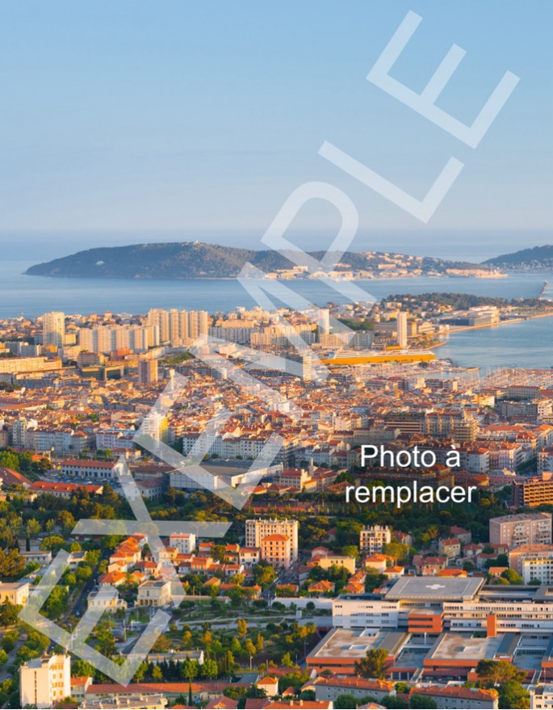

<!-- ceci est la syntaxe pour les commentaires qui n'apparaîtront pas dans le document -->

<!-- raccourci pour les commentaires : ctrl + shift + c -->

<!-- Pour prévisualiser cette page avec une ligne de commande taper : quarto preview exemple_page_rapport.qmd -->

<!-- NB : pour faire un copier coller d'un texte dans un terminal c'est ctrl + shift + v -->

<!-- NB : pour stopper le preview dans un terminal c'est ctrl + c -->

> Lorem ipsum dolor sit amet, consectetur adipiscing elit. Pellentesque egestas leo ut varius imperdiet. Nam ultrices metus eget purus auctor consectetur. Fusce at ex gravida, vestibulum nibh vitae, gravida velit. Fusce ornare rhoncus tincidunt. Morbi sollicitudin pulvinar massa, ac sagittis nisi congue pretium. Quisque vestibulum odio eget lectus vestibulum consectetur ac at lorem. Nunc tempus efficitur odio ac lacinia. Sed tempus lorem felis.

*Neque porro quisquam est qui dolorem ipsum quia dolor sit amet, consectetur, adipisci velit...*


## Mise en forme de base

### Des textes qui attirent l'attention

Morbi eget ex lectus[^1]. Duis et orci a **lectus faucibus semper**. Nullam condimentum quam nec elit *efficitur mollis*. Etiam ac magna efficitur, viverra mauris at, ***efficitur velit***. Nunc quis condimentum^erat^. Morbi~abibendum~ dolor, et condimentum lacus.\
~~Phasellus laoreet lorem id ligula commodo~~, ac euismod eros `malesuada`.

[^1]: Curabitur maximus ullamcorper lorem, et porttitor ante suscipit non.




### Une image entouré de texte

::: img-float
{width="200" style="float: left; margin: 15px;" loading="lazy"}
:::

Lorem ipsum dolor sit amet, consectetur adipiscing elit. Vivamus id massa eleifend, imperdiet lorem sit amet, lacinia tortor. Suspendisse vel posuere purus. Sed hendrerit tellus id gravida malesuada. Praesent condimentum augue in ligula bibendum, fermentum dapibus nibh viverra. Maecenas consequat tempor neque vitae sagittis. Sed vel risus molestie, tincidunt eros at, tempor nulla. Aenean velit neque, bibendum at mauris id, ultricies semper ante. Nam blandit velit vitae est lacinia, sit amet condimentum velit pulvinar. Vestibulum vitae arcu blandit tellus pharetra ultrices non nec erat. Donec a tincidunt lorem.

In elementum eros consequat pulvinar pulvinar. Donec vitae cursus orci, vel pharetra enim. Vivamus viverra tincidunt nibh, consectetur suscipit dui sagittis nec. Nam dictum sed ipsum sit amet convallis. Fusce egestas et erat eu aliquam. Aliquam ac congue velit, eget posuere ipsum. Maecenas nec vehicula dolor, vitae sodales nisi.
\
\

<!-- et pour arrêter l'aspect flottant de l'image on injecte une formule magique en html pur-->
<div style="clear: both;"></div>

### Une variante avec une image toute ronde

::: img-float
{.circle width="220" height="220" style="float: right; margin: 15px;" loading="lazy"}
:::

Lorem ipsum dolor sit amet, consectetur adipiscing elit. Vivamus id massa eleifend, imperdiet lorem sit amet, lacinia tortor. Suspendisse vel posuere purus. Sed hendrerit tellus id gravida malesuada. Praesent condimentum augue in ligula bibendum, fermentum dapibus nibh viverra. Maecenas consequat tempor neque vitae sagittis. Sed vel risus molestie, tincidunt eros at, tempor nulla. Aenean velit neque, bibendum at mauris id, ultricies semper ante. Nam blandit velit vitae est lacinia, sit amet condimentum velit pulvinar. Vestibulum vitae arcu blandit tellus pharetra ultrices non nec erat. Donec a tincidunt lorem.

In elementum eros consequat pulvinar pulvinar. Donec vitae cursus orci, vel pharetra enim. Vivamus viverra tincidunt nibh, consectetur suscipit dui sagittis nec. Nam dictum sed ipsum sit amet convallis. Fusce egestas et erat eu aliquam. Aliquam ac congue velit, eget posuere ipsum. Maecenas nec vehicula dolor, vitae sodales nisi.
\
\

<!-- et pour arrêter l'aspect flottant de l'image on injecte une formule magique en html pur-->
<div style="clear: both;"></div>


### Une image centrée avec la légende centré


::: {style="text-align:center;"}
{fig-align="center" loading="lazy" width="500"}  
:::


### Les puces

Mauris volutpat ultrices est, eu molestie lectus feugiat eu. Pellentesque habitant morbi tristique senectus et netus et malesuada fames ac turpis egestas. Vivamus maximus tortor tortor, id consectetur mauris posuere in.

-   Quisque sollicitudin
    -   et neque
        -   sit amet
        -   venenatis
    -   Aliquam

1.  Suspendisse
2.  rhoncus
3.  cursus

## Les hyperliens Liens

Voilà un hyperlien vers [un site qui va ouvrir une nouvelle page](https://quarto.org){.external target="_blank"}.
Il est aussi possible de faire des liens vers les pages du site, exemple [lien vers la page d'accueil](./index.html)




## Tableau

Pour faire des tableaux simples, passer par le mode visual beaucoup plus pratique !

| Code  | Nom      |
|-------|----------|
| 76540 | Rouen    |
| 76351 | Le Havre |

: Un tableau exemple



## Les équations

Ecriture mathématique intégré dans une ligne : $E = mc^{2}$\
ou bien mise en évidence à la ligne : $$P(E) = {n \choose k} p^k (2-p)^{n-k}$$

Un site bien pratique permet d'écrire en live des équations avec des raccourcis pour les opérateurs : [https://latexeditor.lagrida.com/](https://latexeditor.lagrida.com/)

## Les schemas

La bibliothèque [mermaid](https://mermaid.js.org/){.external target="_blank"} est intégrée à Quarto et permet de réaliser des schémas à partir d'une syntaxe très simplifiée. Pour les fabriquer passer par le [live editor en ligne](https://mermaid.live/edit){.external target="_blank"} puis copier coller votre codee dans un bloc mermaid avec des images qui ouvrent des liens.

```{mermaid}
flowchart LR
  A[Hard edge] --> B(Round edge)
  B --> C{Decision}
  C --> D[Result one]
  C --> E[Result two]
```

Ci-dessous un autre exemple d'une utilisation plus avancée de mermaid.

::: {style="text-align:center;"}

```{mermaid}
flowchart TD
    classDef noBox fill:transparent,stroke:transparent,stroke-width:0px;
    A1 --> Datafoncier
    A1 --> UrbanSimul
    A1 --> DynMark    
    A1 --> LCZ
    
    A1["<a href='https://www.cerema.fr/fr'><span style='opacity:0'>balise non affichée</span></a>"]:::noBox
    
    subgraph "Datafoncier"
      direction LR
      style Datafoncier fill:white,stroke:orange,stroke-width:4px
      A2["<a href='https://datafoncier.cerema.fr/'><span style='opacity:0'>balise non affichée</span></a>"]:::noBox
    end

    subgraph "UrbanSimul"
        direction LR
        style UrbanSimul fill:white,stroke:lightblue,stroke-width:4px
        B1["<a href='https://urbansimul.cerema.fr/'><span style='opacity:0'>balise non affichée</span></a>"]:::noBox
    end
    
    subgraph "DynMark"
        direction LR
        style DynMark fill:white,stroke:lightgreen,stroke-width:4px
        C1["<a href='https://dataviz.cerema.fr/dynmark/'><span style='opacity:0'>balise non affichée</span></a>"]:::noBox
    end
    
    subgraph "LCZ"
        direction LR
        style LCZ fill:white,stroke:lightpink,stroke-width:4px
        D1["<a href='https://www.cerema.fr/fr/presse/dossier/zones-climatiques-locales-lcz-outil-libre-service-visualiser'><span style='opacity:0'>balise non affichée</span></a>"]:::noBox
        D2["<a href='https://cartagene.cerema.fr/portal/apps/dashboards/08066acd23974111be1584a5761fd6b9'><span style='opacity:0'>balise non affichée</span></a>"]:::noBox
    end
```

:::



## Les callout

### Callout basiques

::: callout-note
Note that there are five types of callouts, including: `note`, `tip`, `warning`, `caution`, and `important`.
:::

::: callout-tip
un callout tip
:::

::: callout-warning
Un callout warning
:::

::: callout-caution
un callout caution
:::

::: callout-important
un callout important
:::

### Variantes titre personnalisé, apparance simple et expandable

::: callout-tip
## Mon titre personnalisé

Exemple de callout avec un titre personnalisé
:::

::: {.callout-note appearance="simple"}
## Apparence simple

Il est possible d'utiliser une variante plus simple simplement pour surligner le propos.
:::

::: {.callout-caution collapse="true"}
## La version expandable, cliquez pour en savoir +...

Et voici un callout replié qui peut être déplié pour voir son contenu, très pratiques pour les encarts *en savoir +...*
:::



## <i class="bi bi-bootstrap"></i> Les boostrap icons

Quarto intègre bootstrap et vous pouvez écrire directement du html dans une page en markdown... des milliers d'icons sont disponibles sur le site [bootstrap icons](https://icons.getbootstrap.com/){.external target="_blank"} et permettent d'illustrer votre article, vos titres, vos menus en copiant la syntaxe sur leur site :

<i class="bi bi-balloon-heart"></i> <i class="bi bi-download"></i> <i class="bi bi-database-fill-gear"></i>

## Les emojis 🥰🥰🥰

Très pratique, les emojis permettent de mettre des symboles au milieux de son texte, 😁🤯.

## Les onglets

::: panel-tabset
### Onglet 1

Celui qui lit...

### Onglet 2...

... ceci...

### Et encore un onglet...

... est une patate.
:::



## Value boxes

Quelques exemples de "values boxes" permettant de mettre en évidence des chiffres clefs

<!-- Pour les icon mettre un bs-icon ou un emoji-->
<!-- Valeurs au choix pour la couleur de fond charte cerema-->
<!-- .bg-orangeCerema -->
<!-- .bg-bleuCerema -->
<!-- .bg-bleuExpertise  -->
<!-- .bg-jauneBatiment -->
<!-- .bg-orangeMobilite -->
<!-- .bg-vertInfra -->
<!-- .bg-vertEnvironnementRisques  -->
<!-- .bg-bleuMerLittoral  -->

::::::::: grid
::: {.value-box .bg-bleuCerema .g-col-12 .g-col-md-6 .g-col-lg-4 .g-col-xl-4}
<div class="icon">📊</div>
<div class="title">1st value</div>
<div class="value">123</div>
<div class="details">The 1st detail</div>
:::

::: {.value-box .bg-orangeCerema .g-col-12 .g-col-md-6 .g-col-lg-4 .g-col-xl-4}
<div class="icon"><i class="bi bi-house"></i></div>
<div class="title">2nd value</div>
<div class="value">456</div>
<div class="details">The 2nd detail<br>The 3rd detail</div>
:::

::: {.value-box .bg-vertEnvironnementRisques .g-col-12 .g-col-md-6 .g-col-lg-4 .g-col-xl-4}
<div class="icon"><i class="bi bi-tree-fill"></i></div>
<div class="title">3rd value</div>
<div class="value">789</div>
<div class="details">The 4th detail<br>The 5th detail<br>The 6th detail</div>
:::

::: {.value-box .bg-jauneBatiment .g-col-12 .g-col-md-6 .g-col-lg-4 .g-col-xl-4}
<div class="icon"><i class="bi bi-building"></i></div>
<div class="title">2nd value</div>
<div class="value">122</div>
<div class="details">The 2nd detail<br>The 3rd detail</div>
:::

::: {.value-box .bg-bleuMerLittoral .g-col-12 .g-col-md-6 .g-col-lg-4 .g-col-xl-4}
<div class="icon"><i class="bi bi-water"></i></div>
<div class="title">2nd value</div>
<div class="value">80</div>
<div class="details">The 2nd detail<br>The 3rd detail</div>
:::

::::::::: 


## Mini value boxes

Un autre exemple pour mettre en regard texte et chiffre clef.

::::::::: grid

:::: {.g-col-12 .g-col-md-6 .g-col-lg-8 .g-col-xl-9}
Mauris volutpat ultrices est, eu molestie lectus feugiat eu. Pellentesque habitant morbi tristique senectus et netus et malesuada fames ac turpis egestas. Vivamus maximus tortor tortor, id consectetur mauris posuere in.
::::

::: {.mini-value-box .bg-orangeCerema .g-col-12 .g-col-md-6 .g-col-lg-4 .g-col-xl-3}
<div class="icon-value">
  <div class="icon"><i class="bi bi-water"></i></div>
  <div class="value">80 %</div>
</div>
<div class="details">des gens qui citent des % ne vérifient pas leur source...</div>
:::
:::::::::


::::::::: grid
::: {.mini-value-box .bg-bleuCerema .g-col-12 .g-col-md-6 .g-col-lg-4 .g-col-xl-3}
<div class="icon-value">
  <div class="icon"><i class="bi bi-house"></i></div>
  <div class="value">1250</div>
</div>
<div class="details"> logements vacants, en supposant qu'on sait les compter</div>
:::

::: {.mini-value-box .bg-jauneBatiment .g-col-12 .g-col-md-6 .g-col-lg-4 .g-col-xl-3}
<div class="icon-value">
  <div class="icon"><i class="bi bi-buildings"></i></div>
  <div class="value">75 %</div>
</div>
<div class="details">de logements collectifs dans les Quartiers Prioritaires de la Ville</div>
:::

:::: {.g-col-12 .g-col-md-6 .g-col-lg-4 .g-col-xl-6}
Mauris volutpat ultrices est, eu molestie lectus feugiat eu. Pellentesque habitant morbi tristique senectus et netus et malesuada fames ac turpis egestas. Vivamus maximus tortor tortor, id consectetur mauris posuere in.
::::

:::::::::



## Surligner aux couleurs du cerema

<!-- On ouvre une section pour préciser si on surligne en orange ou en bleu et on utilise la balise <mark> en html ou la syntaxe [This text is highlighted]{.mark} -->

::: {.mark-orangeCerema}
Cupcake biscuit muffin <mark>toffee chocolate cake</mark> topping sweet roll. Jujubes <mark>jelly macaroon topping</mark> bonbon muffin muffin.
:::

::: {.mark-bleuCerema}
Cupcake biscuit muffin <mark>toffee chocolate cake</mark> topping sweet roll. Jujubes <mark>jelly macaroon topping</mark> bonbon muffin muffin.
:::

## Les colonnes

:::::: columns
::: {.column width="45%"}
Lorem ipsum odor amet, consectetuer adipiscing elit. Ligula pharetra aliquet fringilla, dolor himenaeos phasellus varius nostra. Bibendum accumsan curae rutrum luctus posuere porta. Iaculis penatibus ac adipiscing potenti; consequat quisque. Quam lorem ultrices neque nec luctus duis. Consectetur pharetra morbi consectetur mi posuere fusce vitae. Nisi porta ullamcorper nec mollis, eu ante dui efficitur. Torquent iaculis penatibus id montes quisque.
:::

::: {.column width="10%"}
:::

::: {.column width="45%"}
Non nullam congue adipiscing aenean suspendisse senectus? Neque et dui feugiat porta potenti donec aliquet. Luctus nibh ligula interdum; tincidunt est tellus potenti elementum. Pretium amet euismod nullam egestas primis est duis magna. Cursus imperdiet sollicitudin ut eu parturient. Proin morbi inceptos tortor vestibulum, faucibus potenti neque. Penatibus sed tellus; ac maecenas libero pretium. Condimentum gravida egestas hac torquent sociosqu aliquet fermentum duis nisl.
:::
::::::


## Gallerie d'images qui s'adapte à la taille de l'écran

Cliquez sur une image ci-dessous pour la faire apparaître en plein écran et naviguer dans sa galerie :

::::::::: grid
::: {.g-col-12 .g-col-md-6 .g-col-lg-4 .g-col-xl-3}
{.miniature group="my-gallery" fig-align="left" width="500" loading="lazy"}
:::

::: {.g-col-12 .g-col-md-6 .g-col-lg-4 .g-col-xl-3}
{.miniature group="my-gallery" fig-align="left" width="500" loading="lazy"}
:::

::: {.g-col-12 .g-col-md-6 .g-col-lg-4 .g-col-xl-3}
{.miniature group="my-gallery" fig-align="left" width="500" loading="lazy"}
:::

::: {.g-col-12 .g-col-md-6 .g-col-lg-4 .g-col-xl-3}
{.miniature group="my-gallery" fig-align="left" width="500" loading="lazy"}
:::

::: {.g-col-12 .g-col-md-6 .g-col-lg-4 .g-col-xl-3}
{.miniature group="my-gallery" fig-align="left" width="500" loading="lazy"}
:::

::: {.g-col-12 .g-col-md-6 .g-col-lg-4 .g-col-xl-3}
{.miniature group="my-gallery" fig-align="left" width="500" loading="lazy"}
:::
:::::::::



## Gestion des pdf

Les pdf peuvent être mis en lien à télécharger de différente façon :

[<i class="bi bi-filetype-pdf"></i> Ouvrir un pdf dans la même page](pdf/Cerema_Brochure_BasseDef.pdf)

[<i class="bi bi-filetype-pdf"></i> Ouvrir un pdf dans une autre page](pdf/Cerema_Brochure_BasseDef.pdf){.external target="_blank"}

Grâce à l'extension [embedpdf](https://github.com/jmgirard/embedpdf) il est également possible de mettre le document en lecture directement :  




## Et si on sortait du cadre...

### un peu

::: column-body-outset
et de la noblesse de leurs petites façons ; il avait besoin de laver son imagination de toutes les façons d’agir vulgaires, de toutes les pensées désagréables au milieu desquelles il respirait à Verrières. C’était toujours la crainte de manquer, c’étaient toujours le luxe et la misère se prenant aux cheveux. Les gens chez qui il dînait, à propos de leur rôti, faisaient des confidences humiliantes pour eux, et nauséabondes pour qui les entendait.

C’était Mme de Rênal, qui avait fait un voyage à la ville, et qui, montant les escaliers quatre à quatre et laissant ses enfants occupés d’un lapin favori qui était du voyage, était parvenue à la chambre de Julien, un instant avant eux. Ce moment fut délicieux, mais bien court : Mme de Rênal avait disparu quand les enfants arrivèrent avec le lapin, qu’ils voulaient montrer à leur ami. Julien fit bon accueil à tous, même au lapin. Il lui semblait retrouver sa famille ; il sentit qu’il aimait ces enfants, qu’il se plaisait à jaser avec eux. Il était étonné de la douceur de leur voix, de la simplicité
:::

### ou beaucoup

::: column-page
M. de Rênal avait ordonné à Julien de loger chez lui. Personne ne soupçonna ce qui s’était passé. Le troisième jour après son arrivée, Julien vit monter jusque dans sa chambre un non moindre personnage que M. le sous-préfet de Maugiron. Ce ne fut qu’après deux grandes heures de bavardage insipide et de grandes jérémiades sur la méchanceté des hommes, sur le peu de probité des gens chargés de l’administration des deniers publics, sur les dangers de cette pauvre France, etc., etc., que Julien vit poindre enfin le sujet de la visite. On était déjà sur le palier de l’escalier, et le pauvre précepteur à demi disgracié reconduisait avec le respect convenable le futur préfet de quelque heureux département, quand il plut à celui-ci de s’occuper de la fortune de Julien, de louer sa modération en affaires d’intérêt, etc., etc. Enfin M. de Maugiron, le serrant dans ses bras de l’air le plus paterne, lui proposa de quitter M. de Rênal et d’entrer chez un fonctionnaire qui avait des enfants à éduquer, et qui, comme le roi Philippe, remercierait le ciel, non pas tant de les lui avoir donnés que de les avoir fait naître dans le voisinage de M. Julien. Leur précepteur jouirait de huit cents francs d’appointements payables non pas de mois en mois, ce qui n’est pas noble, dit M. de Maugiron, mais par quartier et toujours d’avance.
:::



## Intégrer des contenus extérieur avec un iframe

::: column-screen
C’était Mme de Rênal, qui avait fait un voyage à la ville, et qui, montant les escaliers quatre à quatre et laissant ses enfants occupés d’un lapin favori qui était du voyage, était parvenue à la chambre de Julien, un instant avant eux. Ce moment fut délicieux, mais bien court : Mme de Rênal avait disparu quand les enfants arrivèrent avec le lapin, qu’ils voulaient montrer à leur ami. Julien fit bon accueil à tous, même au lapin. Il lui semblait retrouver sa famille ; il sentit qu’il aimait ces enfants, qu’il se plaisait à jaser avec eux. Il était étonné de la douceur de leur voix, de la simplicité

Ci-dessous un `iframe` pour intégrer une carte interactive faite avec cartagène (NB : les contenus interactifs ne s'impriment pas correctement)

<iframe width="100%" height="800" src="https://cartagene.cerema.fr/portal/apps/dashboards/08066acd23974111be1584a5761fd6b9"></iframe>


:::
